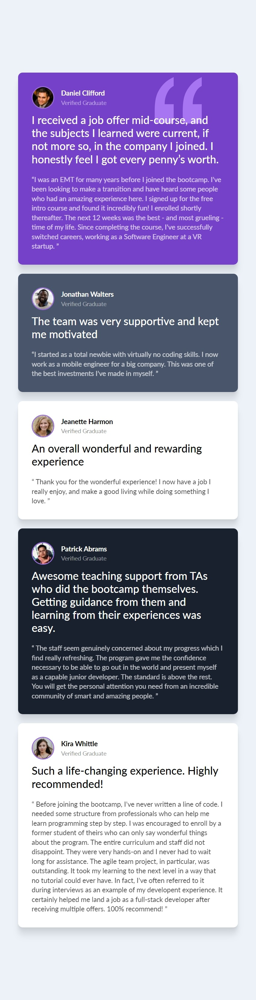

# Frontend Mentor - Testimonials grid section solution

This is a solution to the [Testimonials grid section challenge on Frontend Mentor](https://www.frontendmentor.io/challenges/testimonials-grid-section-Nnw6J7Un7). 

## Table of contents

- [Overview](#overview)
  - [The challenge](#the-challenge)
  - [Screenshot](#screenshot)
  - [Links](#links)
- [My process](#my-process)
  - [Built with](#built-with)
  - [What I learned](#what-i-learned)
  - [Continued development](#continued-development)
  - [Useful resources](#useful-resources)
- [Author](#author)
- [Acknowledgments](#acknowledgments)


## __Overview__

### The challenge

Users should be able to:

- View the optimal layout for the site depending on their device's screen size

### Screenshot

_Desktop Preview_


_Mobile Preview_



### Links

- Solution files: [GitHub Repository]()
- Solution URL: [Add solution URL here](https://your-solution-url.com)


## My process

### Built with

- CSS custom properties
- Flexbox
- CSS Grid


### What I learned

l learnt using CSS Grid layout system, from grid elements, display properties, grid columns, grid rows, grid gaps and implemened them in this project. And also learnt using markdown to document this project.

During the project l could have easily implemented the mobile view with the snippet below:


```css
@media(max-width: 678px){
    .container{
      display: block;
    }

    .card{
        margin: 20px auto;
    }
}
```
But for the sake of learning CSS Grid l used the method below:

```css
@media(max-width: 678px){
    .container{
        grid-template-columns: 1fr;
        width: 100%;
    }

    /* Grid Sections */
    .card:nth-of-type(1){
        grid-column: 1;
    }

    .card:nth-of-type(4){
        grid-column: 1; 
        grid-row: 4;
    }

    .card:nth-of-type(5){
        grid-column: 1; 
        grid-row: 5;
    }
}
```


### Continued development

l will continue following poject challenges to sharpen my skills in HTML, CSS and JavaScript the after l start learning React.js.


### Useful resources

- [Flexbox Crash course](https://youtu.be/3YW65K6LcIA) - This helped me with learning flexbox.

- [CSS Grid Crash course](https://youtu.be/0xMQfnTU6oo) - This is an amazing article which helped me finally understand css grid.

- [Markdown Crash course](https://youtu.be/HUBNt18RFbo) - This helped me with markdown syntax.

## Author

- Website - [Emmanuel Mushambi](https://www.github.com/Munashe-zw)
- Frontend Mentor - [@Munashe-zw](https://www.frontendmentor.io/profile/yourusername)


## Acknowledgments

Thumps up for [Traversy Media](https://www.youtube.com/c/TraversyMedia/about) for the well explained tutorials helping us newbies.

